# GitHub Codespaces Quickstart Guide
## NYC Airbnb ML Pipeline

This guide helps you get started with developing the NYC Airbnb ML Pipeline using GitHub Codespaces.

## Table of Contents

- [Your Learning Journey](#your-learning-journey)
- [First Time Setup](#first-time-setup)
  - [Branch Selection](#1-branch-selection)
  - [Creating Your Codespace](#2-creating-your-codespace)
  - [Weights & Biases API Key Setup](#3-weights--biases-api-key-setup)
- [Resuming an Existing Codespace](#resuming-an-existing-codespace)
- [Terminal Setup](#terminal-setup)
- [Working with the Project](#working-with-the-project)
  - [Pipeline Overview](#pipeline-overview)
  - [Running the Pipeline](#running-the-pipeline)
  - [Using VS Code Tasks](#using-vs-code-tasks)
- [Common Issues](#common-issues)
- [Viewing Results](#viewing-results)
  - [Weights & Biases](#weights--biases)
- [Jupyter Lab (EDA)](#jupyter-lab-eda)
- [GitHub Codespaces Limits](#github-codespaces-limits)
- [Tips & Best Practices](#tips--best-practices)
  - [Environment Management](#environment-management)
  - [Saving Your Work](#saving-your-work)
  - [Working with Artifacts](#working-with-artifacts)
  - [Port Forwarding](#port-forwarding)
- [Student Implementation Tasks](#student-implementation-tasks)
- [Getting Help](#getting-help)
  - [Command Reference](#command-reference)
  - [Documentation](#documentation)
  - [Support](#support)
- [Quick Reference Card](#quick-reference-card)

---

### Your Learning Journey

```mermaid
flowchart LR
    A[1. Setup<br/>Create + Configure] --> B[2. Implement<br/>Code + Test + Debug]
    B --> C{All tasks<br/>done?}
    C -->|No| B
    C -->|Yes| D[Done! 🎉]

    style A fill:#e1f5e1
    style B fill:#e3f2fd
    style D fill:#ffd700
```




---

## First Time Setup

### 1. Branch Selection

When creating your Codespace, you can choose from:
- **`main`** - Stable version (recommended for most users)
- **`feat/codespaces`** - Latest Codespaces features (if available)
- Other feature branches as needed

### 2. Creating Your Codespace

1. Navigate to the repository on GitHub
2. Click the green **Code** button
3. Select **Codespaces** tab
4. Click **Create codespace on [branch]**

**Expected setup time:**
- With prebuild: 30-60 seconds ✨
- Without prebuild: 2-3 minutes

### 3. Weights & Biases API Key Setup

⚠️ **IMPORTANT**: You need a W&B API key for the pipeline to work.

#### Getting Your API Key

1. Go to https://wandb.ai/authorize
2. Copy your API key (new format: `wandb_v1_...`)
3. Keep it secure - you'll need it for the next step

#### Setting Up the Secret in GitHub

1. Go to your repository **Settings**
2. Navigate to **Secrets and variables** → **Codespaces**
3. Click **New repository secret**
4. Name: `WANDB_API_KEY`
5. Value: Paste your W&B API key
6. Click **Add secret**

**If you created your Codespace before adding the secret:**
- You'll need to rebuild your Codespace
- Or manually set it: `export WANDB_API_KEY='your-key-here'`

---

## Resuming an Existing Codespace

If you've already created a Codespace and closed your browser or stopped working:

### How to Resume

1. Navigate to your repository on GitHub
2. Click the green **Code** button
3. Select the **Codespaces** tab
4. You'll see a list of your existing Codespaces:
   - **Active** 🟢 - Currently running (click name to open)
   - **Stopped** ⏸️ - Paused (click name to restart)
5. Click on your Codespace name to resume

### Codespace States

- **Active**: Running and consuming core-hours. Accessible immediately.
- **Stopped**: Not consuming core-hours. Takes 10-20 seconds to restart.
- **Deleted**: Cannot be recovered. Create a new Codespace if needed.

**💡 Tip:** GitHub auto-stops inactive Codespaces after 30 minutes by default (configurable in your GitHub settings).

**⚠️ Important:** Always commit and push your code before stopping! While files persist in stopped Codespaces, it's safer to have your work in git.

---

## Terminal Setup

Your Codespace comes pre-configured with:

- **Shell**: Zsh with Oh My Zsh
- **Conda**: Auto-activates `nyc_airbnb_dev` environment
- **Python**: 3.13
- **MLflow**: 3.3.2
- **wandb**: 0.24.0

You should see the conda environment `(nyc_airbnb_dev)` in your terminal prompt automatically.

---

## Working with the Project

### Pipeline Overview

The ML pipeline consists of **5 default steps**:

1. **download** - Downloads raw data and logs to W&B
2. **basic_cleaning** - Filters price outliers, converts dates, applies geographic bounds
3. **data_check** - Runs pytest-based data validation tests
4. **data_split** - Splits data into train/validation/test sets
5. **train_random_forest** - Trains Random Forest model with feature engineering

**Note**: `test_regression_model` is NOT in the default steps. You must:
1. Train a model first
2. Manually promote the model to "prod" in the W&B interface
3. Explicitly run: `mlflow run . -P steps=test_regression_model`

### Running the Pipeline

**Run the entire pipeline:**
```bash
mlflow run .
```

**Run a specific step:**
```bash
mlflow run . -P steps=download
```

**Run multiple steps:**
```bash
mlflow run . -P steps=download,basic_cleaning
```

**Override configuration parameters:**
```bash
mlflow run . \
  -P steps=download,basic_cleaning \
  -P hydra_options="modeling.random_forest.n_estimators=10 etl.min_price=50"
```

### Using VS Code Tasks

Press `Ctrl+Shift+P` (or `Cmd+Shift+P` on Mac) and type "Tasks: Run Task"

Available tasks:
1. **Run Full Pipeline** (default build task)
2. **Run Download Step**
3. **Run Basic Cleaning Step**
4. **Run Data Check Step**
5. **Run Data Split Step**
6. **Run Train Random Forest Step**
7. **Run Test Regression Model Step**
8. **Open Jupyter Lab (EDA)**
9. **Cleanup MLflow Environments**

---

## Common Issues

### 1. "WANDB_API_KEY not set" Error

**Problem**: Pipeline fails with wandb authentication error.

**Solution**:
```bash
# Check if the key is set
echo $WANDB_API_KEY

# If empty, set it manually
export WANDB_API_KEY='your-key-here'

# Or add it as a Codespaces secret and rebuild
```

### 2. "conda: command not found"

**Problem**: Conda is not available in the terminal.

**Primary Solution (One-time fix):**
```bash
# Initialize conda for your shell
conda init

# Close and reopen your terminal (or open a new terminal tab)
```

After running `conda init` once, conda will be available automatically in all new terminals.

**Temporary Workaround (if you can't restart terminal):**
```bash
# Manually activate conda (must be done in each terminal session)
source /opt/conda/etc/profile.d/conda.sh
conda activate nyc_airbnb_dev
```

**Why this happens**: Conda needs to initialize your shell configuration. The post-start script should do this automatically, but if you're experiencing issues, running `conda init` manually ensures proper setup.

### 3. Disk Space Issues

**Problem**: "No space left on device" error.

**Solution**:
```bash
# Check disk usage
df -h

# Clean up MLflow environments
bash .devcontainer/scripts/cleanup-mlflow-envs.sh

# Or run the VS Code task: "Cleanup MLflow Environments"
```

### 4. Artifact Not Found

**Problem**: W&B artifact not found error.

**Solution**:
- Ensure you've run the previous steps in order
- Check your W&B project at https://wandb.ai
- Verify the artifact name matches in `config.yaml`
- Make sure you're logged in to W&B: `wandb login`

### 5. "ModuleNotFoundError: No module named 'wandb_utils'"

**Problem**: wandb_utils package not installed.

**Solution**:
```bash
cd /workspaces/Project-Build-an-ML-Pipeline-Starter/components
pip install -e .
cd /workspaces/Project-Build-an-ML-Pipeline-Starter
```

### 6. Pipeline Runs Very Slowly

**Problem**: Steps take much longer than expected.

**Solution**:
- Check CPU/memory usage: `top` or `htop`
- Free tier Codespaces have resource limits
- Consider upgrading to a larger machine type
- Clean up MLflow environments to free resources

### 7. Git Operations Fail

**Problem**: "Please tell me who you are" git error.

**Solution**:
```bash
git config --global user.email "your.email@example.com"
git config --global user.name "Your Name"
```

### 8. Wrong Branch

**Problem**: You're on the wrong branch.

**Solution**:
```bash
# List branches
git branch -a

# Switch branches
git checkout main
# or
git checkout feat/codespaces
```

### 9. Rebuild After Configuration Changes

**Problem**: Changes to `.devcontainer/` not reflected.

**Solution**:
1. Press `Ctrl+Shift+P` (or `Cmd+Shift+P`)
2. Type "Codespaces: Rebuild Container"
3. Confirm and wait for rebuild

---

## Viewing Results

### Weights & Biases

View your experiments at: https://wandb.ai

Project name: `nyc_airbnb` (configured in `config.yaml`)

---

## Jupyter Lab (EDA)

To run exploratory data analysis:

```bash
mlflow run src/eda
```

Jupyter Lab will start on port 8888 (automatically forwarded).

**To access:**
1. Look for the "Ports" tab
2. Find port 8888
3. Click the globe icon to open in browser

---

## GitHub Codespaces Limits

**Free tier includes:**
- 60 core-hours per month
- 15 GB storage

**With a 4-core machine:**
- 60 core-hours ÷ 4 cores = **15 hours of usage per month**

**Tips to maximize your free tier:**
- Stop your Codespace when not in use (Settings → Auto-stop)
- Delete old Codespaces you're not using
- Use prebuilds to reduce startup time

---

## Tips & Best Practices

### Environment Management

- **Never modify the base environment**: Always work in `nyc_airbnb_dev`
- **Clean up regularly**: Use the cleanup script to remove old MLflow envs
- **Check conda environments**: `conda env list`

### Saving Your Work

- **Commit frequently**: Don't lose your work!
- **Push to remote**: Codespaces can be deleted
- **Use branches**: Create feature branches for experiments

```bash
git checkout -b feat/my-experiment
git add .
git commit -m "Add my experiment"
git push origin feat/my-experiment
```

### Working with Artifacts

- All artifacts are stored in W&B
- Artifacts are versioned automatically
- Use descriptive names for artifacts
- Tag important artifact versions

### Port Forwarding

Your Codespace automatically forwards:
- Port 5000: MLflow UI
- Port 8888: Jupyter Lab
- Port 8889: Jupyter Notebook (backup)

---

## Student Implementation Tasks

The following areas have TODO comments for you to complete:

1. **`src/basic_cleaning/run.py`**
   - Implement geographic filtering (longitude/latitude bounds)
   - Complete argument parser types/descriptions

2. **`src/data_check/test_data.py`**
   - Implement `test_row_count()` function
   - Implement `test_price_range()` function

3. **`src/train_random_forest/run.py`**
   - Complete pipeline fitting
   - Implement model saving
   - Add non-ordinal categorical preprocessing
   - Implement metric logging

4. **`main.py`**
   - Complete MLflow run calls for all pipeline steps

---

## Getting Help

### Command Reference

```bash
# Check environment
conda info --envs
python --version
mlflow --version
wandb --version

# W&B login
wandb login

# MLflow commands
mlflow run .
mlflow run . -P steps=download
mlflow ui

# Git commands
git status
git log --oneline -10
git branch -a

# Disk usage
df -h
du -sh *

# Cleanup
bash .devcontainer/scripts/cleanup-mlflow-envs.sh
```

### Documentation

- **Project README**: `README.md`
- **Configuration**: `config.yaml`
- **Component docs**: Check each component's `MLproject` file
- **MLflow docs**: https://mlflow.org/docs/latest/index.html
- **W&B docs**: https://docs.wandb.ai/
- **Hydra docs**: https://hydra.cc/

### Support

- Check the project's GitHub Issues
- Review the main README.md
- Consult CLAUDE.md for project-specific guidance

---

## Quick Reference Card

| Task | Command |
|------|---------|
| Run full pipeline | `mlflow run .` |
| Run single step | `mlflow run . -P steps=STEP_NAME` |
| Open MLflow UI | Check port 5000 in Ports tab |
| Open Jupyter | `mlflow run src/eda` → port 8888 |
| Login to W&B | `wandb login` |
| Cleanup envs | Run VS Code task "Cleanup MLflow Environments" |
| Check disk space | `df -h` |
| Rebuild Codespace | Ctrl+Shift+P → "Rebuild Container" |

---

**Happy coding! 🚀**
