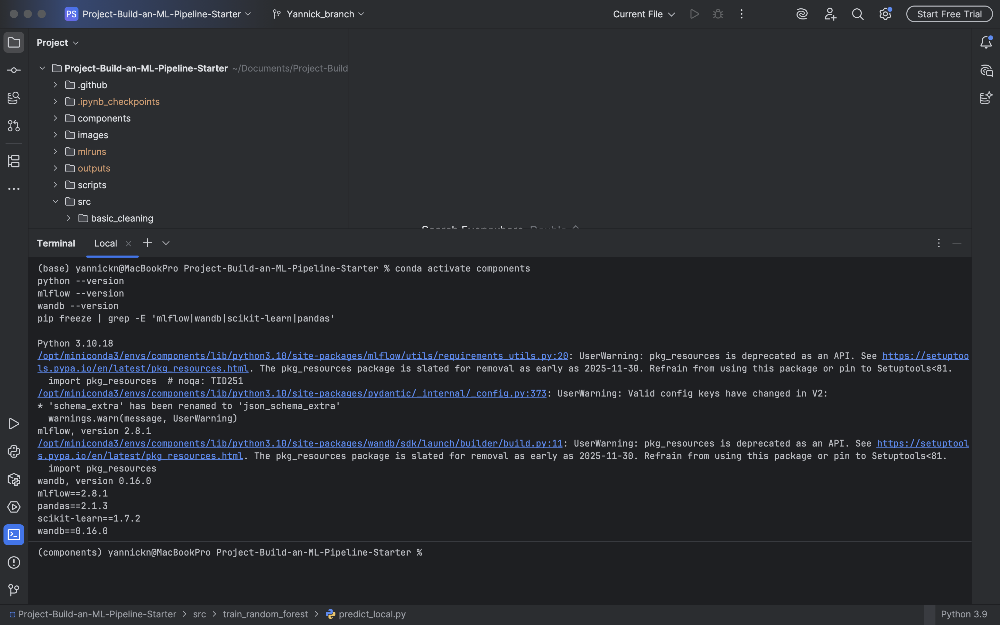
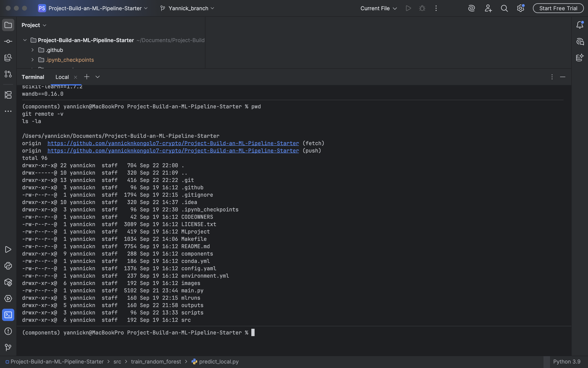
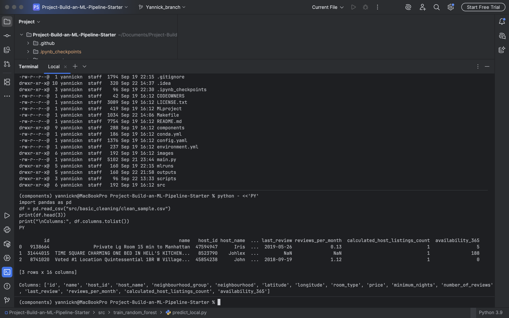
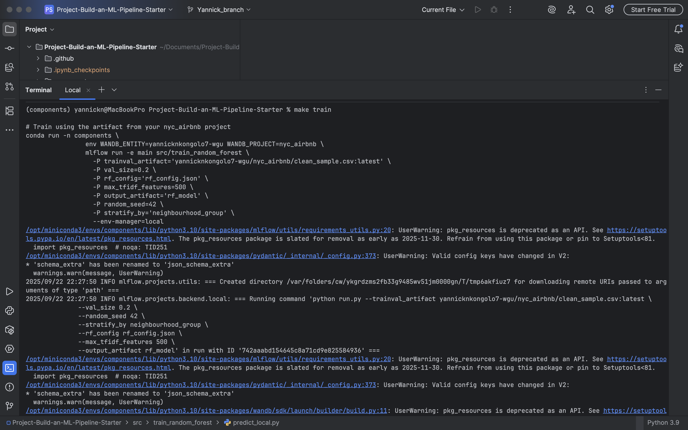
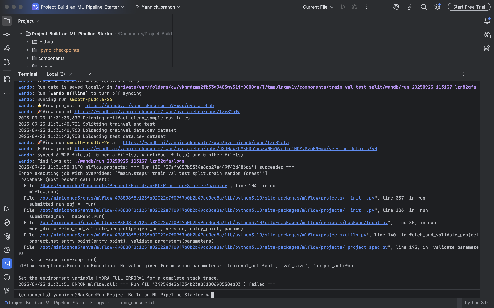
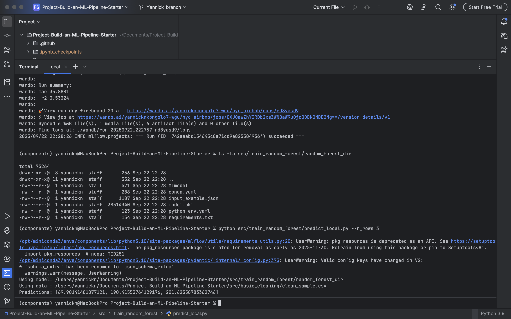
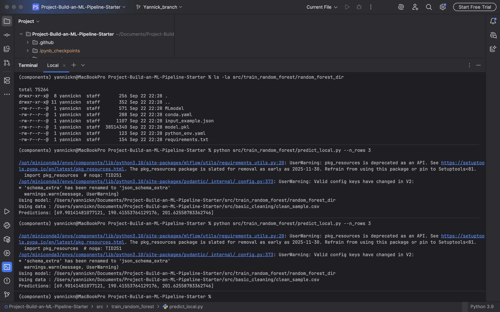
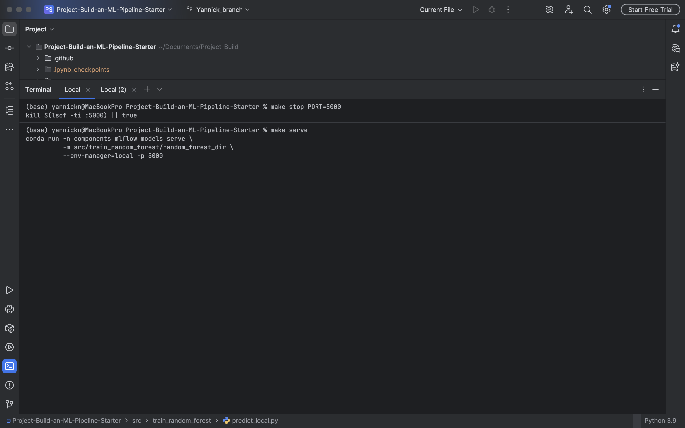
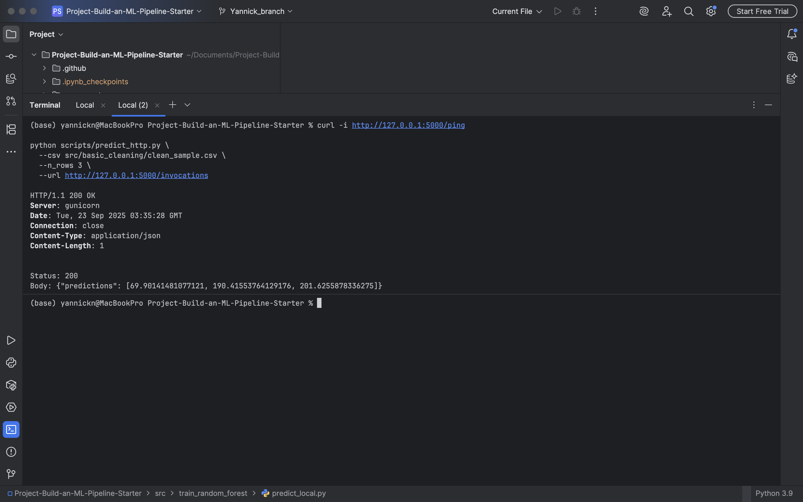
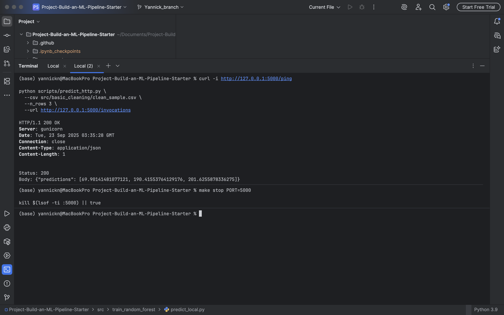

# Build an ML Pipeline for Short-Term Rental Prices in NYC
You work for a property management company renting rooms and properties for short periods of time on various platforms. You need to estimate the typical price for a given property based on similar listings. New data arrives weekly, so the model must be retrained on the same cadence — requiring a reusable, end-to-end pipeline.

This repo implements that pipeline with MLflow, Hydra, scikit-learn, and Weights & Biases (W&B). It also includes local and HTTP prediction helpers and convenient make targets.

## Table of contents

- [Preliminary steps](#preliminary-steps)
  * [Fork the Starter Kit](#fork-the-starter-kit)
  * [Create environment](#create-environment)
  * [Get API key for Weights and Biases](#get-api-key-for-weights-and-biases)
  * [The configuration](#the-configuration)
  * [Running the entire pipeline or just a selection of steps](#Running-the-entire-pipeline-or-just-a-selection-of-steps)
  * [Pre-existing components](#pre-existing-components)


* [Preliminary steps](#preliminary-steps)
## Preliminary steps
### Supported Operating Systems

This project is compatible with the following operating systems:

- **Ubuntu 22.04** (Jammy Jellyfish) - both Ubuntu installation and WSL (Windows Subsystem for Linux)
- **Ubuntu 24.04** - both Ubuntu installation and WSL (Windows Subsystem for Linux)
- **macOS** - compatible with recent macOS versions

Please ensure you are using one of the supported OS versions to avoid compatibility issues.

### Python Requirement

This project requires **Python 3.10**. Please ensure that you have Python 3.10 installed and set as the default version in your environment to avoid any runtime issues.

### Fork the Starter kit
Go to [https://github.com/udacity/Project-Build-an-ML-Pipeline-Starter](https://github.com/udacity/Project-Build-an-ML-Pipeline-Starter)
and click on `Fork` in the upper right corner. This will create a fork in your Github account, i.e., a copy of the
repository that is under your control. Now clone the repository locally so you can start working on it:

```
git clone https://github.com/[your github username]/Project-Build-an-ML-Pipeline-Starter.git
```

and go into the repository:

```
cd Project-Build-an-ML-Pipeline-Starter
```
Commit and push to the repository often while you make progress towards the solution. Remember 
to add meaningful commit messages.

### Create environment
Make sure to have conda installed and ready, then create a new environment using the ``environment.yaml``
file provided in the root of the repository and activate it:

```bash
> conda env create -f environment.yml
> conda activate nyc_airbnb_dev
```

### Get API key for Weights and Biases
Let's make sure we are logged in to Weights & Biases. Get your API key from W&B by going to 
[https://wandb.ai/authorize](https://wandb.ai/authorize) and click on the + icon (copy to clipboard), 
then paste your key into this command:

```bash
> wandb login [your API key]
```

You should see a message similar to:
```
wandb: Appending key for api.wandb.ai to your netrc file: /home/[your username]/.netrc
```


### The configuration
As usual, the parameters controlling the pipeline are defined in the ``config.yaml`` file defined in
the root of the starter kit. We will use Hydra to manage this configuration file. 
Open this file and get familiar with its content. Remember: this file is only read by the ``main.py`` script 
(i.e., the pipeline) and its content is
available with the ``go`` function in ``main.py`` as the ``config`` dictionary. For example,
the name of the project is contained in the ``project_name`` key under the ``main`` section in
the configuration file. It can be accessed from the ``go`` function as 
``config["main"]["project_name"]``.

NOTE: do NOT hardcode any parameter when writing the pipeline. All the parameters should be 
accessed from the configuration file.

### Running the entire pipeline or just a selection of steps
In order to run the pipeline when you are developing, you need to be in the root of the starter kit, 
then you can execute as usual:

```bash
>  mlflow run .
```
This will run the entire pipeline.

When developing it is useful to be able to run one step at the time. Say you want to run only
the ``download`` step. The `main.py` is written so that the steps are defined at the top of the file, in the 
``_steps`` list, and can be selected by using the `steps` parameter on the command line:

```bash
> mlflow run . -P steps=download
```
If you want to run the ``download`` and the ``basic_cleaning`` steps, you can similarly do:
```bash
> mlflow run . -P steps=download,basic_cleaning
```
You can override any other parameter in the configuration file using the Hydra syntax, by
providing it as a ``hydra_options`` parameter. For example, say that we want to set the parameter
modeling -> random_forest -> n_estimators to 10 and etl->min_price to 50:

```bash
> mlflow run . \
  -P steps=download,basic_cleaning \
  -P hydra_options="modeling.random_forest.n_estimators=10 etl.min_price=50"
```

### Pre-existing components
In order to simulate a real-world situation, we are providing you with some pre-implemented
re-usable components. While you have a copy in your fork, you will be using them from the original
repository by accessing them through their GitHub link, like:

```python
# Example snippet
import mlflow

config = {
    "main": {
        "components_repository": "https://github.com/udacity/Project-Build-an-ML-Pipeline-Starter/tree/main/components"
    },
    "etl": {"sample": 1.0},
}

_ = mlflow.run(
    f"{config['main']['components_repository']}/get_data",
    "main",
    version="main",
    env_manager="conda",
    parameters={
        "sample": config["etl"]["sample"],
        "artifact_name": "sample.csv",
        "artifact_type": "raw_data",
        "artifact_description": "Raw file as downloaded",
    },
)
```
where `config['main']['components_repository']` is set to 
[https://github.com/udacity/Project-Build-an-ML-Pipeline-Starter/tree/main/components](https://github.com/udacity/Project-Build-an-ML-Pipeline-Starter/tree/main/components).
You can see the parameters that they require by looking into their `MLproject` file:

- `get_data`: downloads the data. [MLproject](https://github.com/udacity/Project-Build-an-ML-Pipeline-Starter/blob/main/components/get_data/MLproject)
- `train_val_test_split`: segrgate the data (splits the data) [MLproject](https://github.com/udacity/Project-Build-an-ML-Pipeline-Starter/blob/main/components/train_val_test_split/MLproject)

## In case of errors

### Environments
When you make an error writing your `conda.yml` file, you might end up with an environment for the pipeline or one
of the components that is corrupted. Most of the time `mlflow` realizes that and creates a new one every time you try
to fix the problem. However, sometimes this does not happen, especially if the problem was in the `pip` dependencies.
In that case, you might want to clean up all conda environments created by `mlflow` and try again. In order to do so,
you can get a list of the environments you are about to remove by executing:

```
> conda info --envs | grep mlflow | cut -f1 -d" "
```

If you are ok with that list, execute this command to clean them up:

**_NOTE_**: this will remove *ALL* the environments with a name starting with `mlflow`. Use at your own risk

```
> for e in $(conda info --envs | grep mlflow | cut -f1 -d" "); do conda uninstall --name $e --all -y;done
```

This will iterate over all the environments created by `mlflow` and remove them.

### MLflow & Wandb

If you see the any error while running the command:

```
> mlflow run .
```
## Reproducibility Proof — Screenshots & Links

This section shows exactly how to reproduce the results and includes screenshots + links captured from my local run.

### Environment



### Repo



### Data sanity (first rows + columns)



### Train the model (with W&B)







### Confirm the exported model exists



### Local prediction (no server)



### Serve the model (Terminal 1)



### HTTP health & prediction (Terminal 2)



### Stop the server




Please, make sure all steps are using **the same** python version and that you have **conda installed**. Additionally, *mlflow* and *wandb* packages are crucial and should have the same version.


## License

[License](LICENSE.txt)
